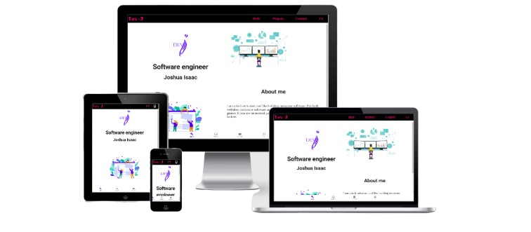

# DEV-J PORTIFOLIO AND CV

> ## This is a professional platform that is ment to showcase my professional skills and persuits to the rest of the world.
- 
    > Access portifolio url <http://jayisaac0.com>

# `TECHNOLOGIES`

- react js
- Node js
- Mysql
- Material lite

## `APPERANCE`

## `INSTALLATION`

- Clone the project repository <https://github.com/jayisaac0/software_dev_portifolio.git>

    >$ **git clone <https://github.com/jayisaac0/software_dev_portifolio.git>**

    >$ **cd software_dev_portfolio**
- Run one of the commands bellow to install all dependencies used in this project
    > $ **yarn add**

    > $ **npm install**
- To launch the product run one of the commands bellow in your terminal
    > $ **yarn run start**
     
    > $ **npm start**
- The project will open in the  local environment on your machine <http://localhost:3000> and can be accessed in your favourite browser
- The page will reload if you make edits. 
- You will also see any lint errors in the console.

## `BACK-END SERVICE INSTALLATION`

- This portifolio has got a back-end service and can be cloned from <http://localhost:3000>
    >$ **heroku git:clone -a mighty-eyrie-34346**

    >$ cd **mighty-eyrie-34346**
- Run one of the commands bellow to install all dependencies used in this project
    > $ **yarn add**

    > $ **npm install**
- To launch service, run one of the commands bellow in your terminal
    > $ **nodemon**
     
    > $ **node index.js**
- The back-end service will run via port **2500** <http://localhost:2500> localy or <https://mighty-eyrie-34346.herokuapp.com> and can be accessed in postman for testing

## `DATABASE USED`

- There are a number of **SQL** databases that can be used in this project and i'll share hor to get to use xampp servers to run serve the portfolio.

- Download and install xampp in your current OS

    > **Xampp server download link**

    > **https://www.apachefriends.org/download.html**

    > **Linux installation guide**

    > **https://vitux.com/how-to-install-xampp-on-your-ubuntu-18-04-lts-system**

    > **Mac installation guide**

    > **https://www.webucator.com/how-to/how-install-start-test-xampp-on-mac-osx.cfm**

    > **Windows installation guide**

    > **https://www.wikihow.com/Install-XAMPP-for-Windows**

### `LICENCE`
MIT licence
